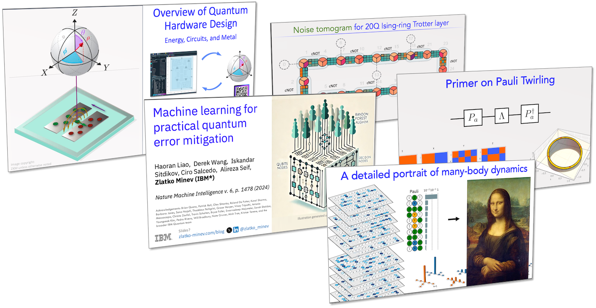

# Zlatko Minev Quantum Repository


> "Creating knowledge is only half the story — sharing it is the other half." 




A curated archive of public research talks, educational lectures, tutorials, and technical notes by Dr. Zlatko K. Minev, Ph.D., spanning 2011 to the present. This repository aims to serve researchers, students, and enthusiasts in quantum computing, quantum physics, hardware design, and related fields.

For more, visit [zlatko-minev.com](https://zlatko-minev.com).


---

## 📂 Repository Contents

* **Research Talks**: Keynotes, conference talks, seminars, and invited colloquia on quantum error mitigation, superconducting hardware, many-body physics, and topological computing.
* **Educational Lectures**: Lecture slides and materials from summer schools, workshops, and university courses. Includes beginner-to-advanced educational content and career talks.
* **Technical Notes**: Concise derivations, foundational calculations, and working research notes prepared for internal and external dissemination.

---

## 🔍 How to Use This Repository

### Browse the Archive

Content is organized into three folders — **research talks**, **educational**, and
**tech notes** — and indexed in [`catalog.json`](catalog.json), a machine-readable
database of every item with titles, years, venues, categories, and tags.

### Download Materials

* 📄 Download individual PDFs directly from the folders above
* 🧾 Download a ZIP of the full repository (GitHub → *Code* → *Download ZIP*)
* 🌀 Clone the repository using Git:

  ```bash
  git clone https://github.com/zlatko-minev/zlatko-minev-quantum-repository.git
  ```

---

## 🛠️ Maintaining the Archive

PDFs are compressed to a balanced, web-friendly quality (no Git LFS). To add new
talks and republish, see [`agent/NOTES.md`](agent/NOTES.md). In short:

```bash
python3 tools/process_pdfs.py     # compress new/updated PDFs (~150 dpi)
python3 tools/build_catalog.py    # regenerate catalog.json (+ tags)
bash    tools/publish.sh          # publish as a single clean commit
```

> The published repository intentionally keeps **no history** — every update is a
> single force-pushed commit. Pristine, full-resolution originals are archived
> locally outside the repo.

---

## 🤝 Contributing

Spotted a typo or want to help improve organization? Feel free to:

* Open an issue
* Submit a pull request with edits or suggestions

---

## 📝 License

This repository is licensed under the [MIT License](LICENSE.md).

